# Diagrama de Arquitectura — Hub Integrador FiberLink Andina Telecom

## Descripción
Arquitectura completa del Hub Integrador sobre AWS que cubre las 3 iniciativas: (1) Plataforma de Integración Empresarial, (2) Automatización Operacional, (3) Plataforma de Observabilidad. Integra el ciclo de vida completo del servicio de internet — desde la instalación hasta la operación — conectando OSS, BSS, canales, red y sistemas on-premises.

---

## Diagrama de Arquitectura

```mermaid
graph TB

    subgraph CANALES["🌐 Canales de Entrada"]
        PORTAL["Portal Cliente\n(Amplify + CloudFront)"]
        APPMOVIL["App Móvil Técnico\n(iOS/Android)"]
        CRM_SAAS["CRM SaaS\n(Salesforce)"]
        NOC_UI["Portal NOC\n(Web UI)"]
    end

    subgraph INGRESO["🔐 Ingreso y Seguridad"]
        WAF["AWS WAF\n(OWASP + Rate Limiting)"]
        CF["CloudFront\n(CDN + TLS 1.3)"]
        ROUTE53["Route 53\n(DNS)"]
        APIGW["API Gateway\n(REST v1 - versionado)"]
        COGNITO["Amazon Cognito\n(OAuth2/OIDC + MFA)"]
    end

    subgraph HUB_INST["⚙️ Hub — Instalación y Activación (ECS Fargate)"]
        MS_ORDEN["ms-orden-instalacion"]
        MS_PROG["ms-programacion-instalacion"]
        MS_ACT["ms-activacion-servicio"]
        MS_FAC["ms-facturacion"]
        MS_INV["ms-inventario"]
    end

    subgraph HUB_OBS["📡 Hub — Observabilidad de Red (ECS Fargate)"]
        MS_CORR["ms-correlacion-incidentes"]
        MS_INTRED["ms-integracion-red"]
    end

    subgraph SERVERLESS["⚡ Serverless"]
        MS_NOTIF["ms-notificaciones\n(Lambda)"]
        MS_AUDIT["ms-auditoria\n(Lambda)"]
        SF["Step Functions\n(Saga Activación)"]
        LAMBDA_NORM["Lambda Normalización\n(NMS → canónico)"]
        GLUE["AWS Glue\n(ETL Inventario Oracle)"]
    end

    subgraph MENSAJERIA["📨 Mensajería y Eventos"]
        EB["EventBridge\n(Bus de eventos Hub)"]
        KINESIS["Kinesis Data Streams\n(Alarmas de red en tiempo real)"]
        SQS_NOTIF["SQS\n(Notificaciones)"]
        SQS_ERP["SQS\n(ERP Integración)"]
        SQS_ITSM["SQS\n(ITSM Azure reintentos)"]
        SNS["Amazon SNS\n(Alertas operativas)"]
    end

    subgraph DATOS["🗄️ Almacenamiento y Datos"]
        RDS_INST["RDS PostgreSQL\n(órdenes + programación)"]
        RDS_ACT["RDS PostgreSQL\n(activación + facturación)"]
        RDS_INV["RDS PostgreSQL\n(inventario)"]
        RDS_OBS["RDS PostgreSQL\n(correlación + integración red)"]
        DYNAMO["DynamoDB\n(notificaciones)"]
        REDIS["ElastiCache Redis\n(caché + deduplicación)"]
        S3["S3\n(contratos, evidencias, logs)"]
        OPENSEARCH["OpenSearch\n(auditoría + búsqueda)"]
        GLACIER["S3 Glacier\n(retención 5 años)"]
        REDSHIFT["Amazon Redshift\n(KPIs incidentes + SLA)"]
        KINESIS_FIREHOSE["Kinesis Firehose\n(logs → S3 / Redshift)"]
    end

    subgraph OBSERVABILIDAD["📊 Observabilidad"]
        CW["CloudWatch\n(métricas + logs + alarmas)"]
        XRAY["X-Ray\n(trazas distribuidas)"]
        GRAFANA["Grafana\n(dashboards operativos)"]
        POWERBI["Power BI Azure\n(tableros ejecutivos + SLA)"]
    end

    subgraph SEGURIDAD["🔒 Seguridad y Gobierno"]
        SECRETS["Secrets Manager\n(credenciales NMS, ERP, ITSM)"]
        KMS["KMS\n(cifrado en reposo)"]
        CLOUDTRAIL["CloudTrail\n(auditoría AWS)"]
        SECURITYHUB["Security Hub\n(postura seguridad)"]
        ECR["ECR\n(repositorio imágenes Docker)"]
        CFN["CloudFormation\n(IaC)"]
        IAM["IAM\n(roles y políticas)"]
    end

    subgraph INTEGRACIONES["🔗 Sistemas Externos"]
        VPN["VPN / PrivateLink\n(conectividad on-prem)"]
        OSS_ONPREM["OSS On-Premises\n(provisión ONT/router/OLT)"]
        ERP_ONPREM["ERP On-Premises\n(facturación Unix)"]
        INV_ONPREM["Inventario Oracle\n(topología de red)"]
        NMS_REGIONALES["NMS Regionales\n(alarmas on-prem)"]
        ITSM_AZURE["ITSM Azure\n(mesa de ayuda)"]
        IVR_ONPREM["IVR On-Premises\n(call center)"]
        SES["Amazon SES\n(email)"]
        WHATSAPP["WhatsApp Business API\n(Meta)"]
        GCP_PUBSUB["GCP Pub/Sub\n(analítica de fallas)"]
    end

    %% ── Canales → Seguridad
    ROUTE53 --> CF
    PORTAL --> WAF
    APPMOVIL --> WAF
    NOC_UI --> WAF
    WAF --> CF
    CF --> APIGW
    CRM_SAAS --> APIGW
    APIGW --> COGNITO
    COGNITO -.->|token validado| APIGW

    %% ── API Gateway → Microservicios
    APIGW --> MS_ORDEN
    APIGW --> MS_PROG
    APIGW --> MS_ACT
    APIGW --> MS_FAC
    APIGW --> MS_INV
    APIGW --> MS_NOTIF
    APIGW --> MS_CORR
    APIGW --> MS_INTRED

    %% ── Microservicios → Bases de datos
    MS_ORDEN --> RDS_INST
    MS_PROG  --> RDS_INST
    MS_ACT   --> RDS_ACT
    MS_FAC   --> RDS_ACT
    MS_INV   --> RDS_INV
    MS_NOTIF --> DYNAMO
    MS_CORR  --> RDS_OBS
    MS_INTRED --> RDS_OBS

    %% ── Caché y deduplicación
    MS_PROG  --> REDIS
    MS_FAC   --> REDIS
    MS_INV   --> REDIS
    MS_CORR  --> REDIS

    %% ── Bus de eventos (Hub EventBridge)
    MS_ORDEN --> EB
    MS_PROG  --> EB
    MS_ACT   --> EB
    MS_FAC   --> EB
    MS_INV   --> EB
    MS_CORR  --> EB
    MS_INTRED --> EB

    %% ── EventBridge → consumidores
    EB --> MS_NOTIF
    EB --> MS_AUDIT
    EB --> MS_INV
    EB --> MS_CORR
    EB --> SQS_NOTIF
    EB --> SQS_ERP
    EB --> SQS_ITSM

    %% ── Kinesis (alarmas de red)
    NMS_REGIONALES --> KINESIS
    KINESIS --> LAMBDA_NORM
    LAMBDA_NORM --> MS_INTRED
    MS_INTRED --> KINESIS
    KINESIS --> MS_CORR

    %% ── Step Functions (saga activación)
    MS_ACT --> SF
    SF --> MS_ORDEN
    SF --> MS_FAC
    SF --> XRAY

    %% ── Notificaciones
    SQS_NOTIF --> MS_NOTIF
    MS_NOTIF --> SES
    MS_NOTIF --> WHATSAPP
    MS_NOTIF --> IVR_ONPREM
    MS_NOTIF --> PORTAL

    %% ── Auditoría
    MS_AUDIT --> OPENSEARCH
    MS_AUDIT --> S3
    S3 -.->|lifecycle policy| GLACIER

    %% ── Almacenamiento
    MS_ACT --> S3
    SQS_ERP --> MS_FAC

    %% ── ITSM Azure
    SQS_ITSM --> ITSM_AZURE

    %% ── ETL Inventario
    GLUE --> VPN
    VPN --> INV_ONPREM
    GLUE --> MS_INTRED

    %% ── KPIs e inteligencia
    KINESIS --> KINESIS_FIREHOSE
    KINESIS_FIREHOSE --> REDSHIFT
    KINESIS_FIREHOSE --> S3
    REDSHIFT --> POWERBI
    GCP_PUBSUB -.->|analítica fallas| REDSHIFT

    %% ── Observabilidad
    MS_ORDEN --> CW
    MS_PROG  --> CW
    MS_ACT   --> CW
    MS_FAC   --> CW
    MS_INV   --> CW
    MS_NOTIF --> CW
    MS_AUDIT --> CW
    MS_CORR  --> CW
    MS_INTRED --> CW
    MS_ACT   --> XRAY
    CW --> GRAFANA
    SNS --> CW
    CLOUDTRAIL --> CW
    SECURITYHUB --> CW
    GRAFANA --> POWERBI

    %% ── Seguridad
    MS_ACT   --> SECRETS
    MS_NOTIF --> SECRETS
    MS_FAC   --> SECRETS
    MS_INTRED --> SECRETS
    KMS -.->|cifrado| RDS_INST
    KMS -.->|cifrado| RDS_ACT
    KMS -.->|cifrado| RDS_OBS
    KMS -.->|cifrado| S3
    ECR -.->|imágenes| MS_ORDEN
    ECR -.->|imágenes| MS_PROG
    ECR -.->|imágenes| MS_ACT
    ECR -.->|imágenes| MS_CORR

    %% ── Integraciones on-premises
    SF       --> VPN
    VPN      --> OSS_ONPREM
    SQS_ERP  --> VPN
    VPN      --> ERP_ONPREM
    MS_INV   --> VPN
    VPN      --> INV_ONPREM
```

---

## Descripción por capa

### 🌐 Canales de entrada
| Canal | Tecnología | Iniciativa |
|-------|-----------|------------|
| Portal del Cliente | Amplify + CloudFront | I1, I2 |
| App Móvil Técnico | iOS/Android → API Gateway | I2 |
| CRM SaaS | REST → API Gateway | I1, I2 |
| Portal NOC | Web UI → API Gateway | I3 |

### ⚙️ Hub Integrador — 9 Microservicios

| Microservicio | Cómputo | Iniciativa | Rol |
|--------------|---------|------------|-----|
| ms-orden-instalacion | ECS Fargate | I1, I2 | Ciclo de vida de órdenes |
| ms-programacion-instalacion | ECS Fargate | I2 | Agenda y recursos |
| ms-activacion-servicio | ECS Fargate + Step Functions | I1, I2 | Saga de activación |
| ms-facturacion | ECS Fargate | I1, I2 | Ciclo de cobro |
| ms-inventario | ECS Fargate | I1, I2 | Equipos y materiales |
| ms-notificaciones | Lambda | I2, I3 | Email, WhatsApp, IVR, portal |
| ms-auditoria | Lambda | I1, I3 | Log inmutable de eventos |
| ms-correlacion-incidentes | ECS Fargate | I3 | Motor de correlación NOC |
| ms-integracion-red | ECS Fargate + Lambda | I1, I3 | Ingesta y normalización NMS |

### 📨 Mensajería
| Componente | Uso | Iniciativa |
|-----------|-----|------------|
| EventBridge | Bus de eventos Hub (instalación/activación) | I1, I2 |
| Kinesis Data Streams | Alarmas de red en tiempo real (alta velocidad) | I3 |
| SQS Notificaciones | Envío asíncrono email/WhatsApp | I2 |
| SQS ERP | Integración asíncrona ERP Unix | I1 |
| SQS ITSM | Reintentos publicación ITSM Azure | I3 |
| SNS | Alertas operativas NOC y equipo | I3 |

### 🗄️ Almacenamiento
| Componente | Uso | Iniciativa |
|-----------|-----|------------|
| RDS PostgreSQL (×4) | Datos transaccionales por dominio | I1, I2, I3 |
| DynamoDB | Notificaciones, idempotencia | I2 |
| ElastiCache Redis | Caché + deduplicación alarmas | I2, I3 |
| S3 + Glacier | Contratos, evidencias, auditoría 5 años | I1, I3 |
| OpenSearch | Búsqueda analítica de auditoría | I1, I3 |
| Redshift | KPIs de incidentes, SLA, churn | I3 |
| Kinesis Firehose | Pipeline logs → S3/Redshift | I3 |

### 📊 Observabilidad
| Componente | Uso |
|-----------|-----|
| CloudWatch | Métricas, logs, alarmas de todos los MS |
| X-Ray | Trazas distribuidas saga activación |
| Grafana | Dashboards operativos tiempo real |
| Power BI Azure | Tableros ejecutivos, SLA, duración incidentes |

---

## Volumetría y escalado

| Parámetro | Valor | Decisión |
|-----------|-------|---------|
| Usuarios activos diarios | 50.000 | ECS Fargate auto scaling |
| Transacciones/día | 250.000 (70% escritura) | PostgreSQL réplicas + Redis |
| Pico de demanda | 4x (~650 escrituras/seg) | SQS + Kinesis absorben bursts |
| Alarmas de red en pico | Miles simultáneas | Kinesis Data Streams (shards escalables) |
| Actividad diaria | 18 horas continuas | Fargate (no Lambda) para MS core |
| Retención auditoría | 5 años | S3 + Glacier lifecycle policy |
