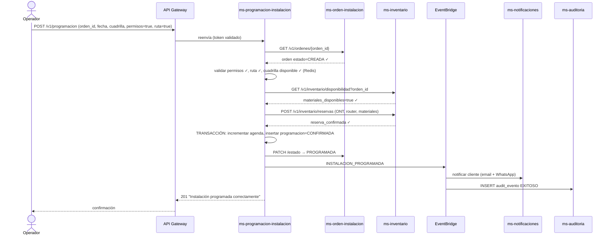
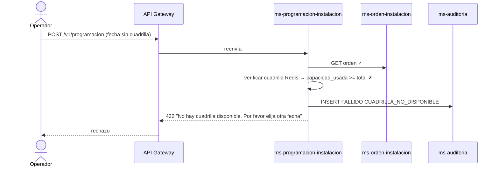
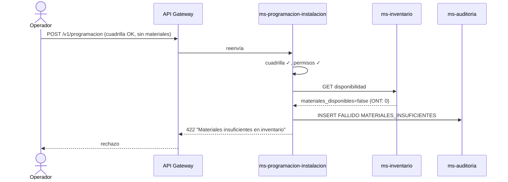
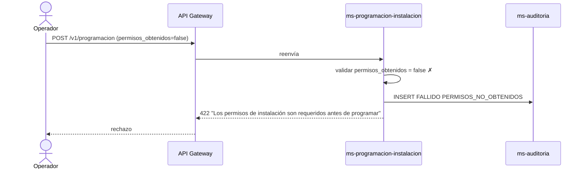
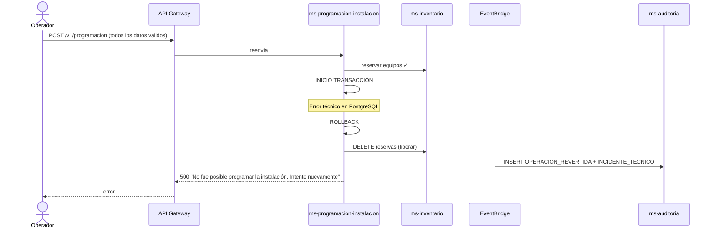

# Diagrama de Secuencia — RF01: Programar Instalación del Servicio de Internet

---

## SC01 — Programación exitosa

---

## SC02 — Cuadrilla no disponible

---

## SC03 — Materiales insuficientes

---

## SC04 — Permisos no obtenidos

---

## SC05 — Error técnico con rollback

