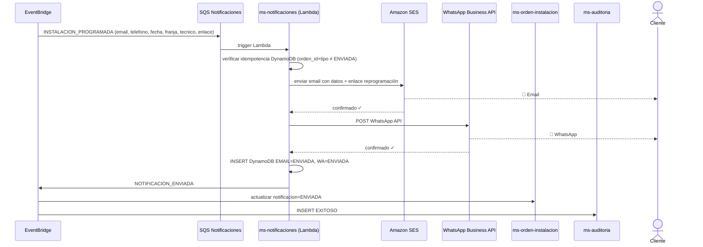
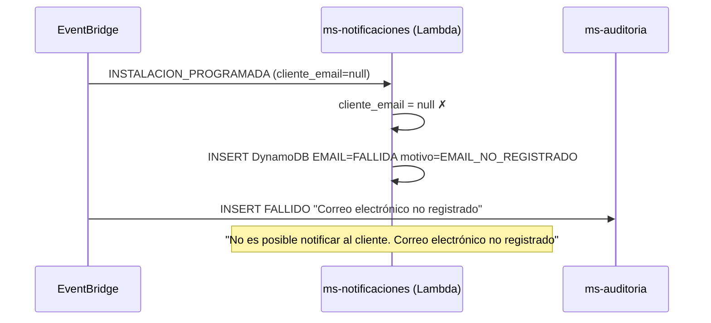
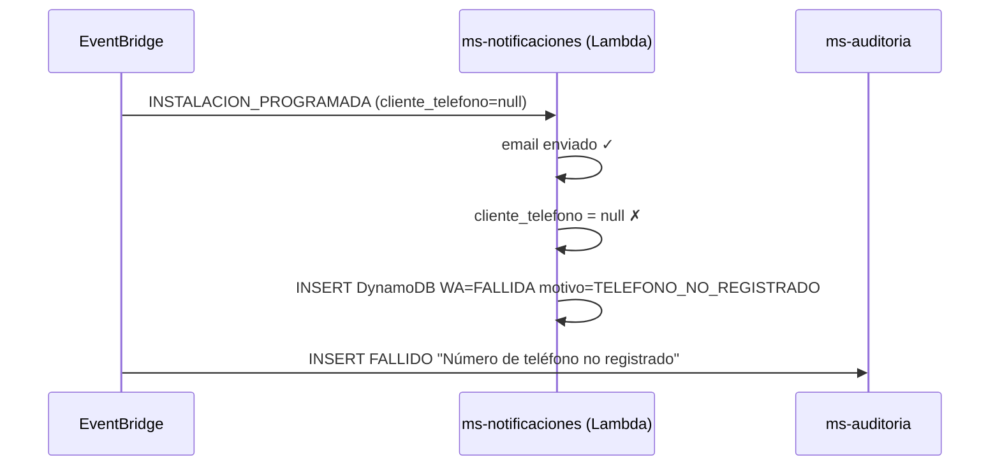
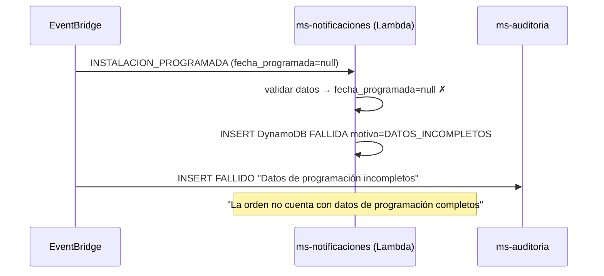
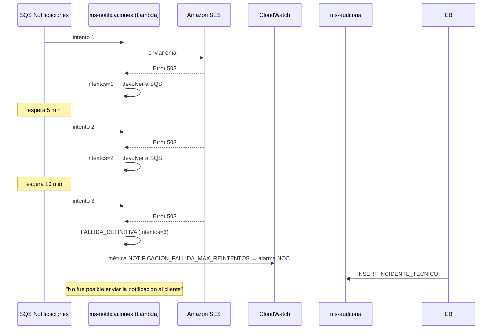

# Diagrama de Secuencia — RF02: Notificar Programación de Instalación al Cliente

---

## SC01 — Notificación exitosa (email + WhatsApp)

---

## SC02 — Email no registrado

---

## SC03 — Teléfono no registrado

---

## SC04 — Datos de programación incompletos

---

## SC05 — Error técnico con reintento automático (hasta 3 veces)

