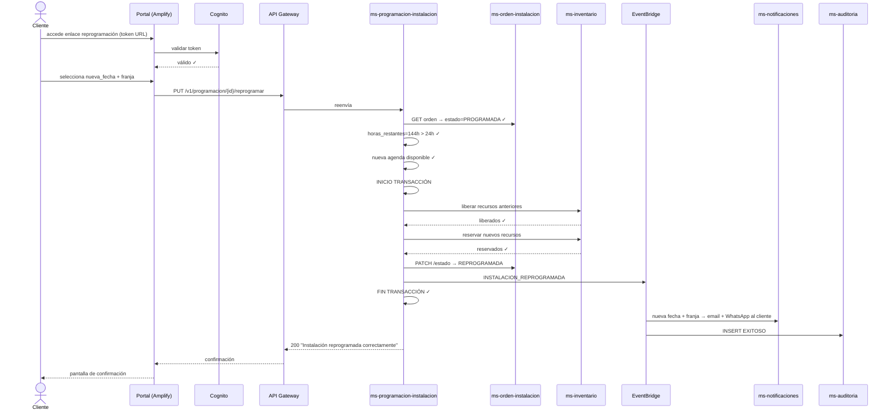
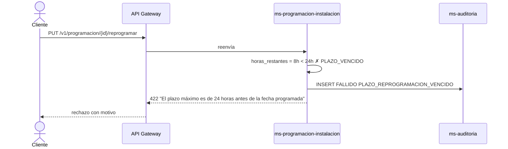
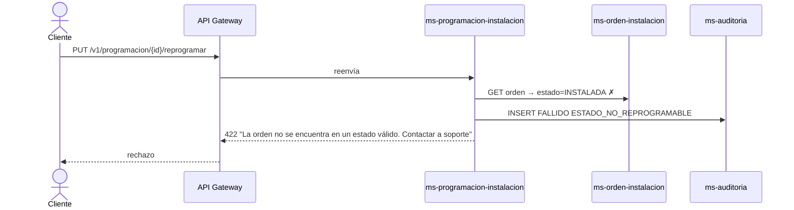
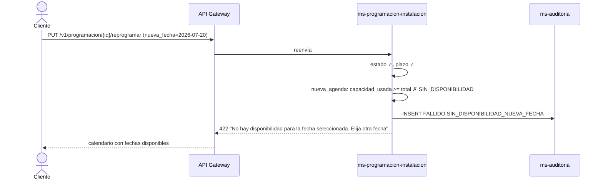
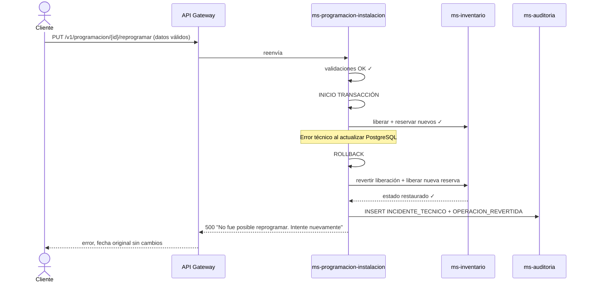

# Diagrama de Secuencia — RF03: Reprogramar Instalación del Servicio de Internet

---

## SC01 — Reprogramación exitosa

---

## SC02 — Fuera del plazo permitido (< 24 horas)

---

## SC03 — Orden en estado no reprogramable

---

## SC04 — Sin disponibilidad en nueva fecha

---

## SC05 — Error técnico con rollback

