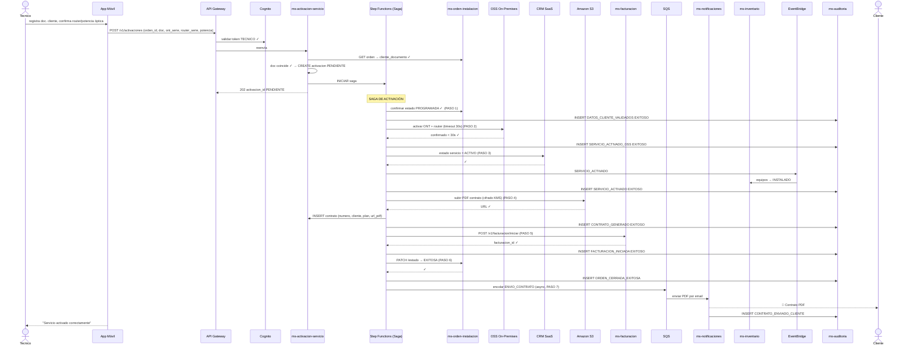
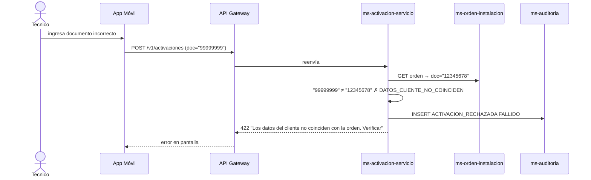
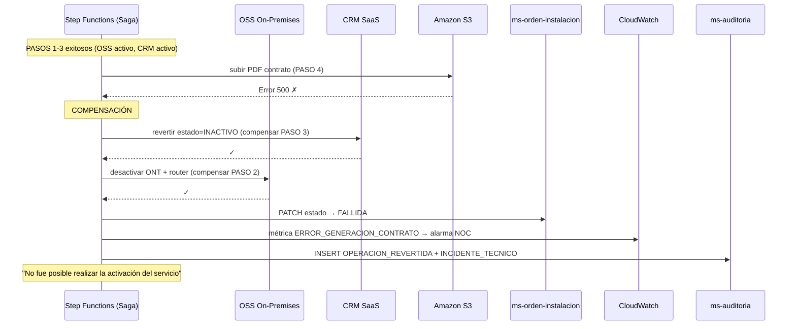
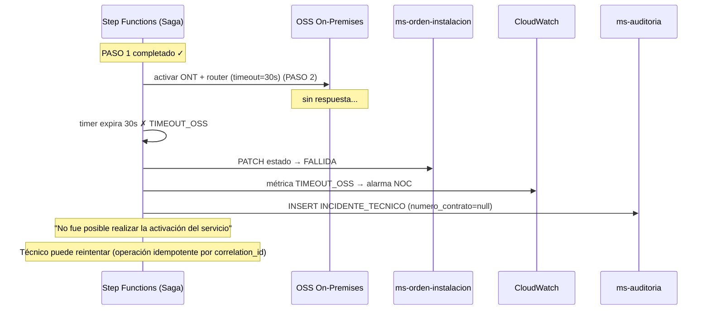

# Diagrama de Secuencia — RF04: Activar Servicio de Internet

---

## SC01 — Activación exitosa

---

## SC02 — Datos del cliente no coinciden

---

## SC03 — Error técnico al generar contrato (compensación)

---

## SC04 — Timeout activación OSS (> 30 segundos)

