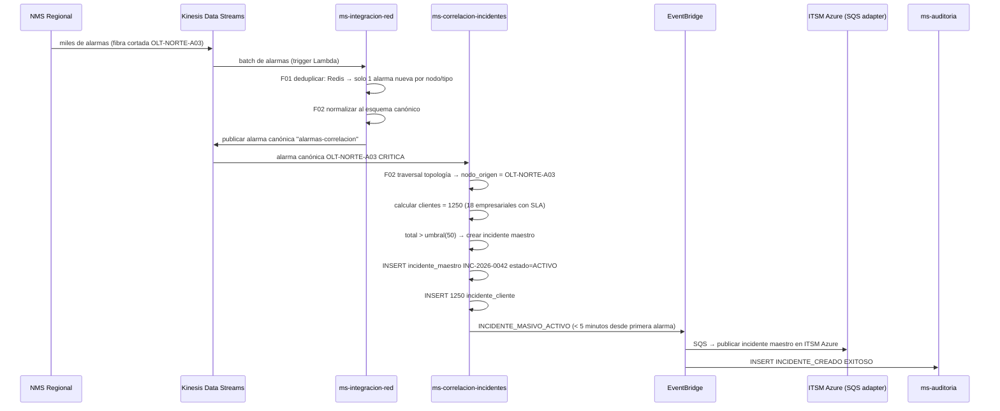
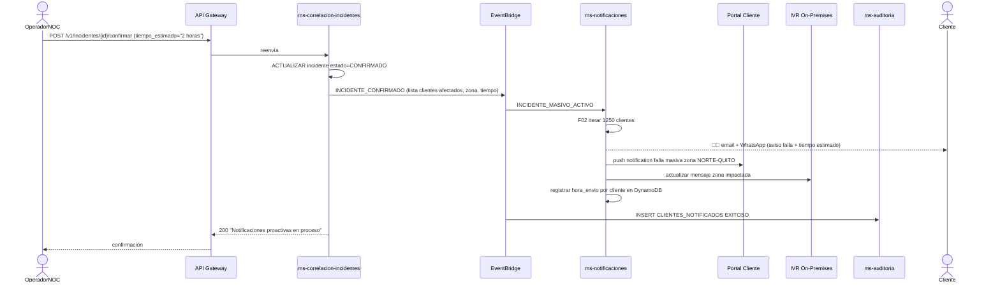
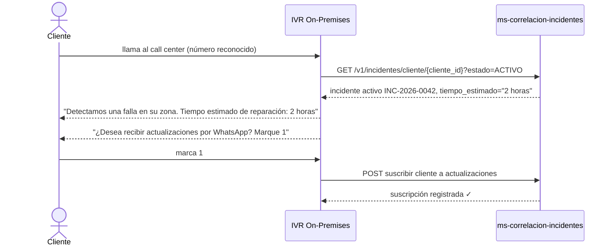
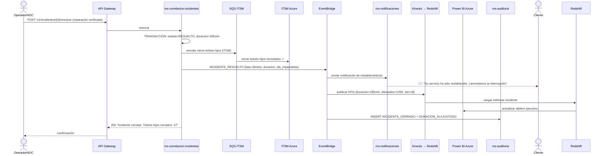
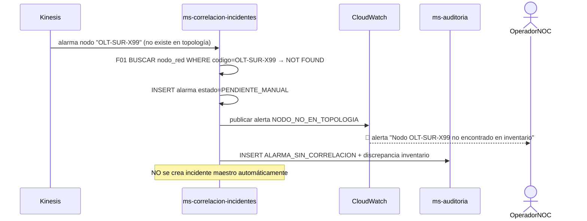
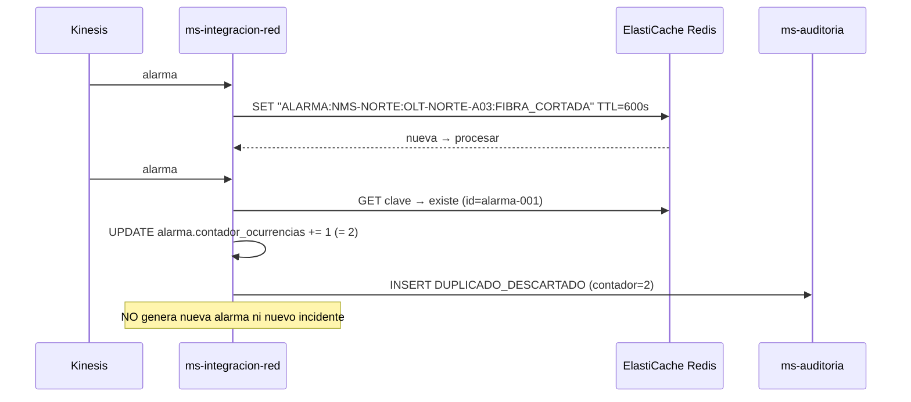
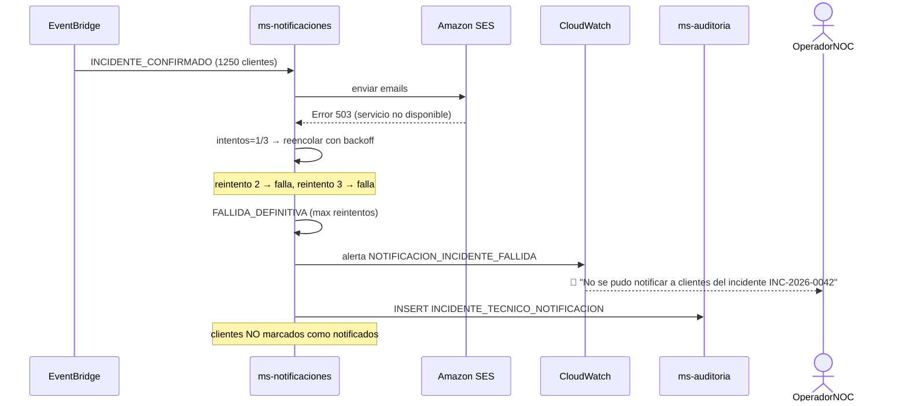
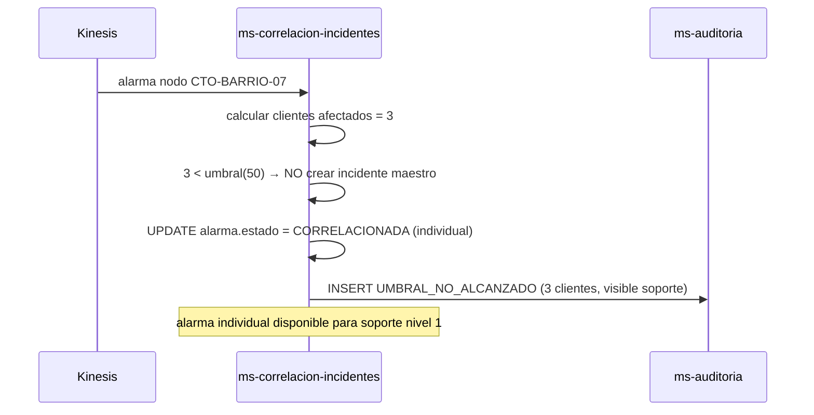
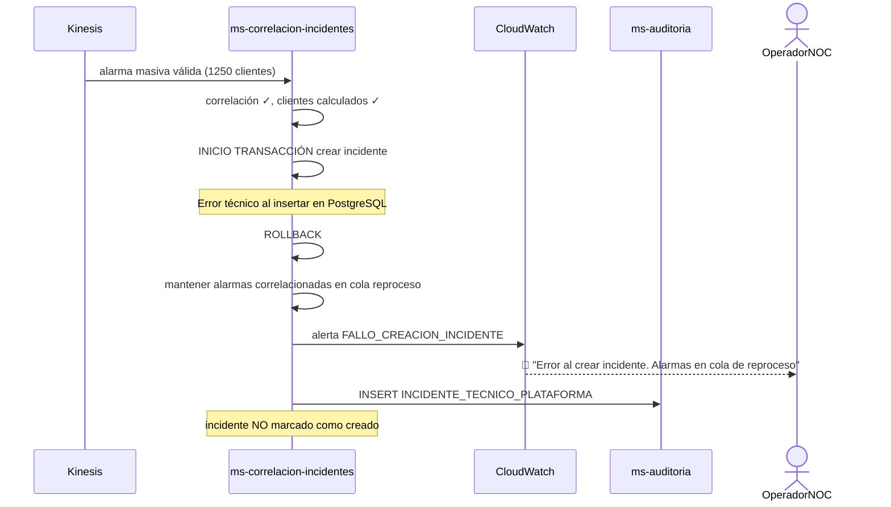

# Diagrama de Secuencia — RF05: Correlación de Incidentes de Red con Clientes Afectados

---

## SC01 — Falla masiva agrupada en un solo incidente (< 5 minutos)

---

## SC02 — Notificación proactiva a clientes afectados

---

## SC03 — Cliente llama al call center y recibe info sin agente

---

## SC04 — Cierre del incidente con resolución en cascada

---

## SC05 — Alarma sin correlación (inventario desactualizado)

---

## SC06 — Descarte de eventos duplicados

---

## SC07 — Falla en entrega de notificaciones proactivas

---

## SC08 — Umbral no alcanzado (falla localizada)

---

## SC09 — Error técnico al crear incidente maestro

