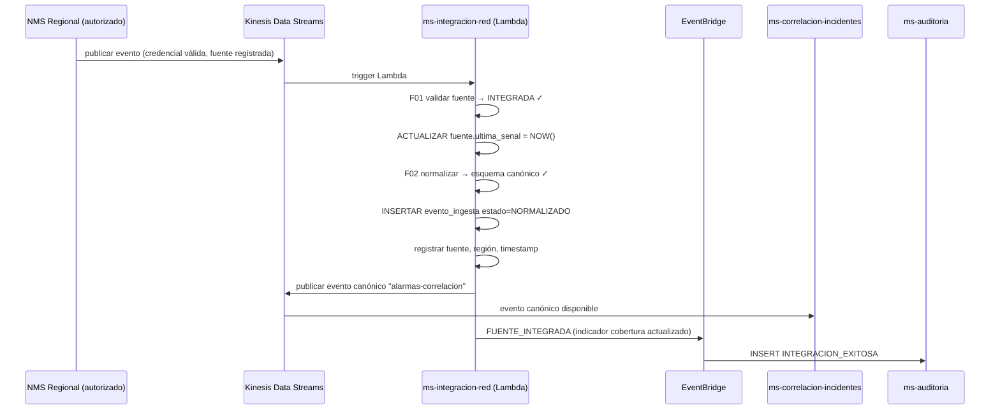
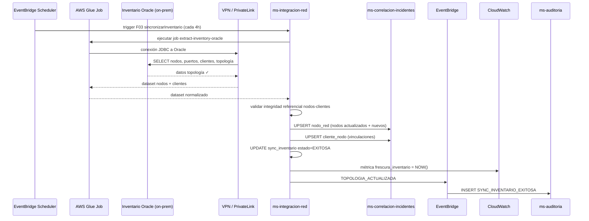
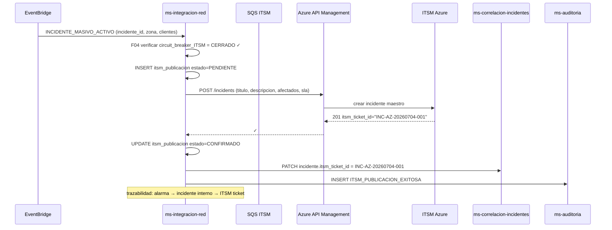
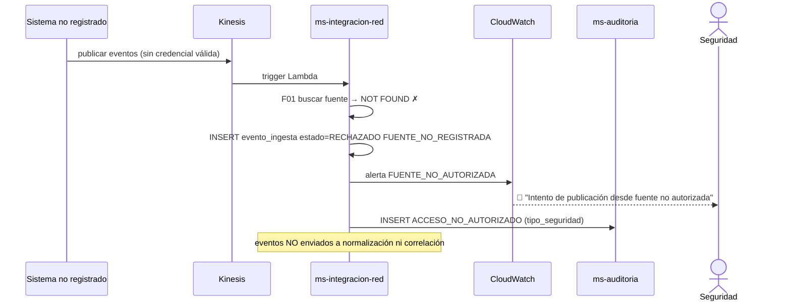
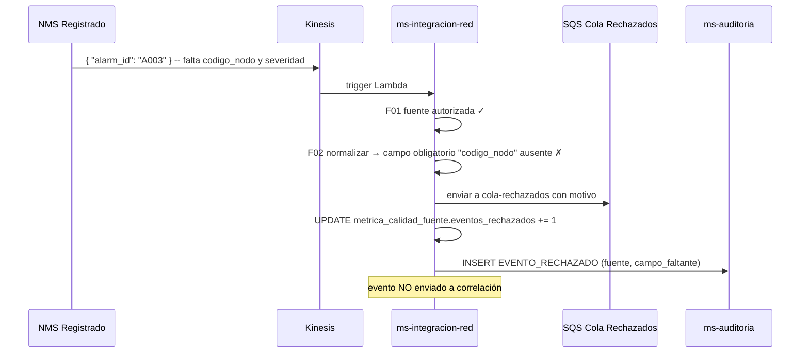
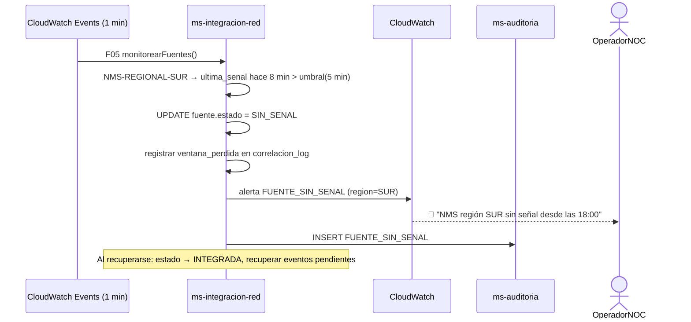
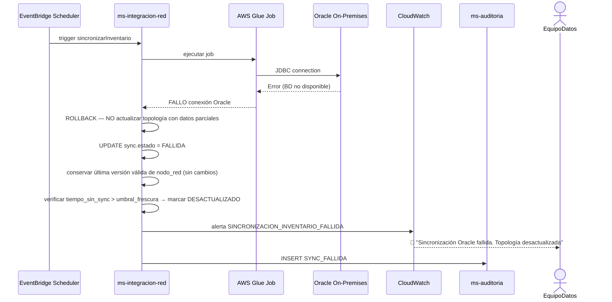
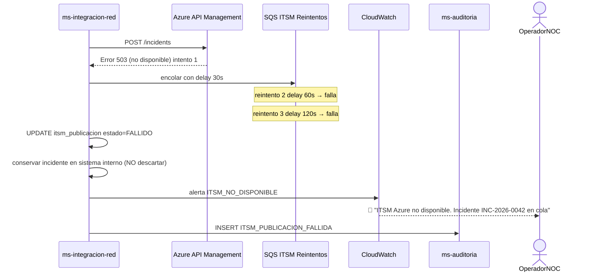
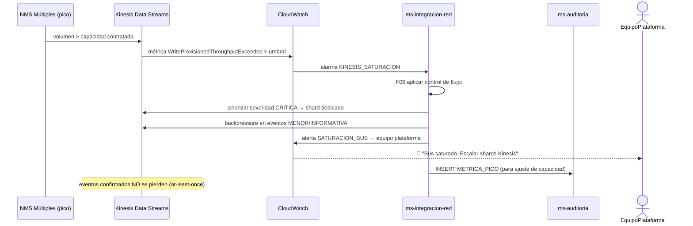

# Diagrama de Secuencia — RF06: Integración de Fuentes de Red al Bus de Eventos

---

## SC01 — Integración exitosa de NMS regional al bus



---

## SC02 — Normalización de formatos heterogéneos

```mermaid
sequenceDiagram
    participant NMS_A as NMS Operador A (formato propio)
    participant NMS_B as NMS Operador B (formato diferente)
    participant Kinesis as Kinesis
    participant msIntRed as ms-integracion-red (Lambda)
    participant msAudit as ms-auditoria

    NMS_A->>Kinesis: { "alarm_id": "A001", "node_code": "OLT-N01", "sev": 1 }
    NMS_B->>Kinesis: { "eventId": "B002", "elementId": "RTR-S05", "priority": "high" }

    Kinesis->>msIntRed: batch de eventos
    msIntRed->>msIntRed: aplicar esquema_mapeo fuente_A:
      alarm_id → alarma_externa_id
      node_code → codigo_nodo
      sev:1 → severidad:CRITICA
    msIntRed->>msIntRed: aplicar esquema_mapeo fuente_B:
      eventId → alarma_externa_id
      elementId → codigo_nodo
      priority:high → severidad:MAYOR
    msIntRed->>msIntRed: conservar id_original de cada fuente
    msIntRed->>Kinesis: publicar 2 eventos en esquema canónico ✓
    msIntRed->>msAudit: INSERT NORMALIZACION_EXITOSA (2 eventos, 2 formatos)
    Note over msIntRed: NO se descarta ningún evento por diferencia de formato
```

---

## SC03 — Sincronización de inventario Oracle con motor de correlación



---

## SC04 — Publicación de incidente al ITSM Azure



---

## SC05 — Rechazo de fuente no autorizada



---

## SC06 — Evento con campos obligatorios ausentes



---

## SC07 — Pérdida de conectividad con NMS regional



---

## SC08 — Falla en sincronización del inventario Oracle



---

## SC09 — ITSM Azure no disponible al publicar incidente



---

## SC10 — Saturación del bus de eventos por pico de tráfico


